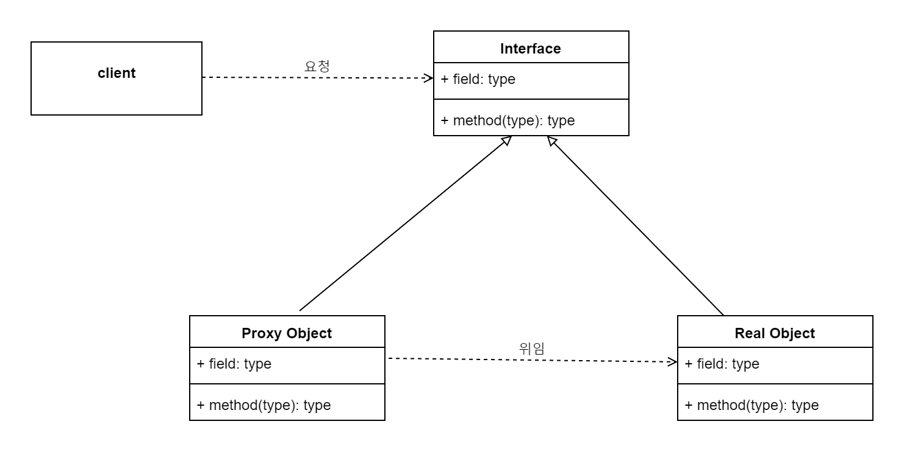

# 프록시 패턴

보안, lazy loading, Aop등 다양한 용도로 프록시를 사용

프록시 패턴은 대리인 패턴으로 원래 객체를 래핑해서 필요할 때 호출하도록 동작함.


# Proxy 예제 코드
```java
public class ProxyThumbnail implements Thumbnail {

    private final String text;
    private Thumbnail thumbnail;

    public ProxyThumbnail(String text) {
        this.text = text;
    }

    @Override
    public String getText() {
        return this.text;
    }

    @Override
    public Image getImage() {
        if (this.thumbnail == null) {
            this.thumbnail = new RealThumbnail(text, new Image());
            System.out.println("proxy: load original Image");
        }

        return this.thumbnail.getImage();
    }
}
```